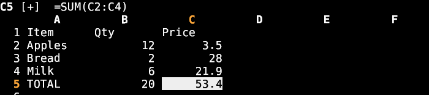

# grid



    

An AI-native terminal spreadsheet. Open a CSV or workbook, navigate and edit
like a spreadsheet, write formulas, or just tell Claude what to change. A small,
fast, single binary — part of the [Fe2O3](https://github.com/isene/fe2o3) Rust
terminal suite.

<br clear="left"/>

## The idea

A spreadsheet that stays out of your way and lets the AI do the tedious parts.
Type values and formulas directly, or hit `c` and say *"add a Total row that
sums each column"* — grid hands the sheet to Claude and applies what comes back.
No menus, no ribbons: keyboard-driven, instant, scriptable.

## Screenshot



## Features

- **Formats** — reads/writes CSV, reads xlsx/ods (via calamine) and writes xlsx
  (via rust_xlsxwriter), preserving formulas *and* their computed values.
- **Formula engine** — hand-rolled, no spreadsheet runtime: arithmetic, ranges
  (`A1:B3`), comparisons, `&` concatenation, and ~25 functions (SUM, AVERAGE,
  MIN/MAX, COUNT, IF, AND/OR, ROUND, CONCAT, VLOOKUP, …). Whole-sheet recalc with
  cycle detection (`#CYCLE`).
- **AI editing** — `c` → describe a change in plain English; Claude rewrites the
  sheet, formulas included.
- **Cell colours** — set a cell's foreground/background (`C`, palette 0-255 or a
  name); persists to xlsx natively and to CSV via a `.gcolors` sidecar.
- **Undo** — every edit, clear, colour and AI change is undoable (`u`).
- **Multi-sheet** — `Tab` cycles sheets in a workbook.
- **Dates** — Excel date serials shown as readable `YYYY-MM-DD`.
- Tiny binary, blocking input — zero idle CPU.

## Install

```bash
# From a release (Linux/macOS, x86_64/aarch64)
chmod +x grid-* && sudo cp grid-linux-x86_64 /usr/local/bin/grid

# Or build from source (needs the sibling crust crate alongside)
git clone https://github.com/isene/crust
git clone https://github.com/isene/grid
cd grid && cargo build --release
```

## Usage

```bash
grid budget.csv      # open a file
grid sheet.xlsx      # open a workbook (Tab cycles sheets)
grid new.csv         # start a fresh sheet
```

## Keys

| Key | Action |
|-----|--------|
| `h j k l` / arrows | move |
| `g` `G` | first / last row |
| `0` `$` | first / last column |
| `PgUp` `PgDn` | page |
| `Enter` `i` | edit cell |
| `=` | start a formula |
| `c` | AI edit (Claude) |
| `C` | set cell colour (fg,bg) |
| `u` | undo |
| `d` `Del` | clear cell |
| `Tab` `S-Tab` | next / previous sheet |
| `s` | save |
| `?` | help |
| `q` / `Q` | quit / quit without saving |

## Formulas

`=A1+B2*2`, ranges `=SUM(A1:A10)`, text `=A1&" "&B1`, logic
`=IF(C1>0,"ok","no")`, and: SUM AVERAGE MIN MAX COUNT COUNTA PRODUCT IF AND OR
NOT ROUND ABS INT SQRT MOD POWER CONCAT LEN LEFT RIGHT MID UPPER LOWER TRIM
VLOOKUP.

## Part of Fe2O3

grid is one tool in the [Fe2O3](https://github.com/isene/fe2o3) suite of fast
Rust terminal apps. It builds on [crust](https://github.com/isene/crust) (the
TUI foundation) and pairs with [viewer](https://github.com/isene/viewer), which
launches grid for spreadsheet files.

## License

Public domain ([Unlicense](https://unlicense.org)).
